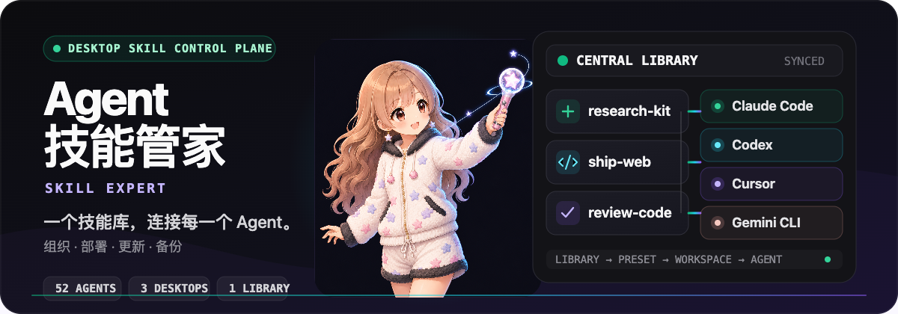
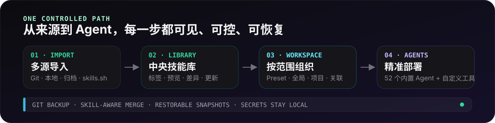

<p align="center">
  
</p>

<p align="center">
  <strong>统一管理所有 Agent Skills 的桌面控制台。</strong><br>
  一次导入，清晰组织；按 Agent 或项目精准部署，并让每次变更都可恢复。
</p>

<p align="center">
  <a href="https://github.com/Alex-Shen1121/skill-expert/releases"><strong>下载</strong></a>
  &nbsp;·&nbsp;
  <a href="#三步上手">三步上手</a>
  &nbsp;·&nbsp;
  <a href="#cli">CLI</a>
  &nbsp;·&nbsp;
  <a href="./README.md">English</a>
</p>

<p align="center">
  <a href="https://github.com/Alex-Shen1121/skill-expert/releases"></a>
  
  <a href="./LICENSE"></a>
</p>

## 为什么需要 Agent 技能管家

Agent Skills 往往散落在全局目录、项目目录、Git 仓库、压缩包和不同编码工具中。Agent 技能管家把它们收束为一套看得见的管理模型：

- **一个技能库，多种来源** —— 从 Git、本地目录、`.zip` / `.skill` 归档或 [skills.sh](https://skills.sh) 市场安装。
- **按真实范围部署** —— 分开管理 Agent 的用户级目录、项目级目录和任意关联目录，不混淆边界。
- **变更前先看清楚** —— 预览 `SKILL.md`、比较本地与上游内容、批量检查更新；涉及删除时停下来等待人工确认。
- **出错也能恢复** —— 保留按 Skill 合并的 Git 历史、可恢复快照和不阻塞的冲突选择，机密信息始终留在本机。

<p align="center">
  
</p>

几个概念刻意保持独立：

- **技能库** 是受管 Skills 的中央来源。
- **Preset（预设）** 是可复用的技能分组；应用时执行一次写入，不是隐藏的实时绑定。
- **全局工作区** 反映 Agent 用户级技能目录里的真实内容，包括未通过本应用安装的 Skills。
- **项目工作区** 管理项目级 Agent 目录，并支持与技能库双向同步。
- **关联工作区** 把任意 Skills 根目录作为独立工作区管理。

## 三步上手

1. 从 [Releases](https://github.com/Alex-Shen1121/skill-expert/releases) 下载当前平台的安装包。
2. 从 Git、本地目录、归档文件或市场添加一个 Skill。
3. 点击 Skill 卡片上的 Agent 角标，或进入 **全局工作区** / **项目工作区**，把它部署到正确范围。

可选：打开 **备份** 页，使用 GitHub 登录一次，即可自动获得版本化备份和多设备同步。

## 可以管理什么

- **Skills** —— 搜索、预览、标签、筛选、多选、导出、删除、来源检查和上游差异比较。
- **Presets** —— 创建命名技能组，并为选定 Agent 激活，同时保留每个 Agent 的可见状态。
- **Agents** —— 使用 52 个内置集成，调整常用 Agent 顺序、修改路径，或添加自定义工具。
- **工作区** —— 用一致的交互管理全局、项目和关联 Skills。
- **更新** —— 在前台批量检查与更新，显示进度，支持重试、停止和并发数配置。
- **日常运维** —— 选择软链接或复制模式，配置代理、主题，查看活动记录并导出 Issue 所需日志。
- **应用更新** —— macOS 与 Windows 上只负责提醒；下载、安装与重启都由你主动触发。

## 支持的 Agents

开箱支持 52 个 Agent，包括：

Claude Code · Codex · Cursor · GitHub Copilot · Gemini CLI · OpenCode · OpenClaw · Hermes Agent · OpenHands · Cline · Goose · Windsurf · Continue · Grok · Antigravity · Qwen Code · Crush · Kilo Code · Roo Code · Amp · Kiro CLI · Droid · TRAE IDE · Warp · Qoder · CodeBuddy

**设置** 会优先展示当前机器已检测到的 Agent。自定义工具同样可以使用技能库、工作区和部署控制。

## 不锁定你的备份

侧边栏的 **备份** 页把技能库保存在普通 Git 仓库中。GitHub 向导会创建私有 `skill-expert-backup` 仓库，也可以配置任意 Git 远端。

- 本地停止编辑后自动提交；其他设备的更新会自动合并。
- 合并以 Skill 为单位：一台设备改名、另一台编辑内容时可以正确组合。
- 真冲突不会覆盖本机版本。系统先创建安全快照，再让你选择 **保留本机**、**使用远端** 或 **两个都保留**。
- Skills、标签、Presets 和 Agent 开关会备份；令牌、代理设置、本机接线和超过 100 MB 的 Skills 留在本机。
- 远端始终是普通 Git 仓库，无需 Agent 技能管家也能克隆和检查。

## CLI

桌面应用与 `skill-expert-cli` 共用同一套 Rust 核心、SQLite 数据库、中央技能库和部署引擎。

```bash
# 查看技能库
npm run cli -- repo status
npm run cli -- skills list

# 安装 Skill，然后部署给指定 Agent
npm run cli -- skills install vercel-labs/agent-skills@react-best-practices
npm run cli -- skills deploy <ref> --agent claude_code --agent codex

# 只检查上游来源，不修改已部署文件
npm run cli -- skills check --all
```

<details>
<summary><strong>更多 CLI 工作流</strong></summary>

```bash
# 先预览会删除内容或改变结构的操作
npm run cli -- skills remove <ref> --dry-run
npm run cli -- skills set-source <ref> --git-url you/skills --subpath my-skill --dry-run

# 整理并部署 Preset
npm run cli -- presets create Frontend --description "前端工作流"
npm run cli -- presets add-skill Frontend <ref>
npm run cli -- presets deploy Frontend --agent codex

# 检查实际的 Agent 部署状态
npm run cli -- skills status <ref>
npm run cli -- skills undeploy <ref> --agent codex --dry-run

# 操作外部 Skills 检出目录，不污染该目录
npm run -s cli -- --skills-root /path/to/my-skills --json skills list

# 把二进制安装到 PATH
npm run cli:install
```

当 `--skills-root` 指向外部检出目录时，CLI 的数据库和缓存等状态保存在 `~/.skill-expert/external/` 下，外部检出目录本身不会被污染。

更新会替换整个 Skill 目录。如果上游删除了本地仍存在的路径，CLI 不会应用更新，而是报告 `held_back_removals`；这类内容损失必须由人在桌面应用中确认。

CLI 与桌面应用共用同一个仓库锁。如果运行命令时应用处于休眠状态，手动刷新一次即可。

</details>

## 本地开发

### 前置依赖

- Node.js 18+
- Rust 工具链
- 当前平台的 [Tauri 2 依赖](https://v2.tauri.app/start/prerequisites/)

```bash
npm install
npm run tauri:dev
```

| 层 | 技术 |
| --- | --- |
| 前端 | React 19、TypeScript、Vite、Tailwind CSS |
| 桌面 | Tauri 2 |
| 核心 | Rust |
| 存储 | SQLite（`rusqlite`） |
| 国际化 | `react-i18next` |

构建命令：

```bash
npm run tauri:build
npm run cli:build
```

## 下载与支持

请从 [Agent 技能管家 Releases](https://github.com/Alex-Shen1121/skill-expert/releases) 下载当前安装包。

### 在 macOS 上安全打开

macOS 安装包采用 ad-hoc 签名但未经公证。如果 Gatekeeper 阻止首次启动，请先尝试打开应用一次，再进入 **系统设置 → 隐私与安全性 → 仍要打开** 并确认。请保持 Gatekeeper 启用；这只会批准 Agent 技能管家。按需测试包的说明参见 [手工测试包指南](docs/test-packages.md)。

可以通过 **设置 → 报告问题** 提交可复现问题，也可以使用 [Issue tracker](https://github.com/Alex-Shen1121/skill-expert/issues)。欢迎贡献；提交 Pull Request 前请先阅读 [CONTRIBUTING.md](CONTRIBUTING.md)。

## 许可证

[MIT](LICENSE)
